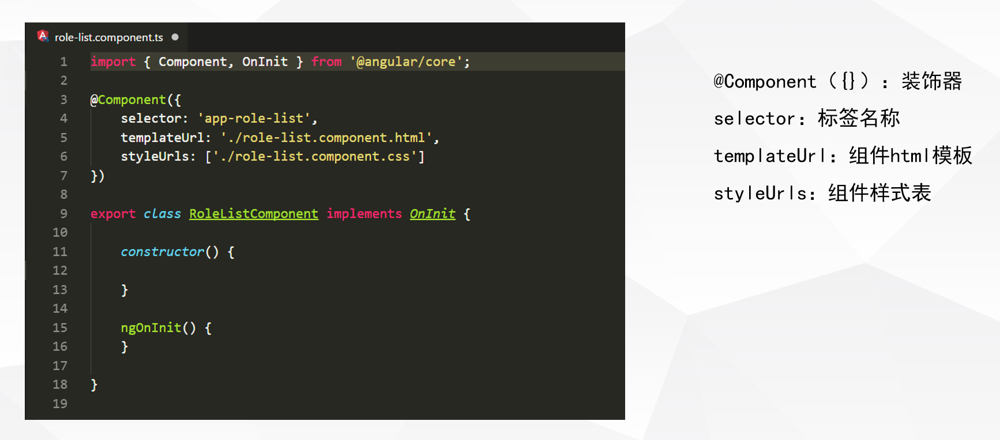

##定义
> 组件是应用中最小的视图区域，组件的类中定义了组件的应用逻辑，为视图提供支持，组件通过一些由属性和方法组成的 API 与视图交互，组件文件的基本结构如下：

##组件交互
###一：通过输入型绑定把数据从父组件传到子组件
子组件:

>  .ts中

>  `import { Component, Input } from '@angular/core'`; 

>  `@Input() variable: string;`; 

>  .html中

>  `<children>{{variable}}</children> `; 

父组件:

>  .html中
>
    <parent>
        <children [variable]=“’类别’”></children> 
    </parent>

###二：通过父组件监听子组件的事件

子组件:

>  .ts中

>  `import { Component, Output , EventEmitter} from '@angular/core';`

>  `@Output() variable = new EventEmitter<boolean>();`

>
    do(data:any){
        this. variable.emit(data);
	};

> .html中

>
    

父组件：  

> .html中

> 
    

		< children (variable)=“doing($event)”></ children >
    

> .ts中

> 
    doing(event:any){
		do something…..
    };

###三：父组件与子组件通过本地变量互动

子组件：

> .ts中

>
    do(): void{
        do something
	};

父组件：

> .html中

>
    

	      < children  #localVariable ></ children >
	      <h4 (click)=“localVariable.do()”></h4>
	

###四：通过父组件调用@ViewChild()

子组件：

> .ts中

>
    class children {
        doing(){
	        do something ……
        };
    }

父组件：

> .ts中

> 
    import { ViewChild } from '@angular/core’;
    import { childrenComponent } from ‘../partial/ children;
>
    class parent {
        @ViewChild(childrenComponent)
        private children : childrenComponent;
        do(){
            this. children.doing();
        };
    }

> .html中

>
    

