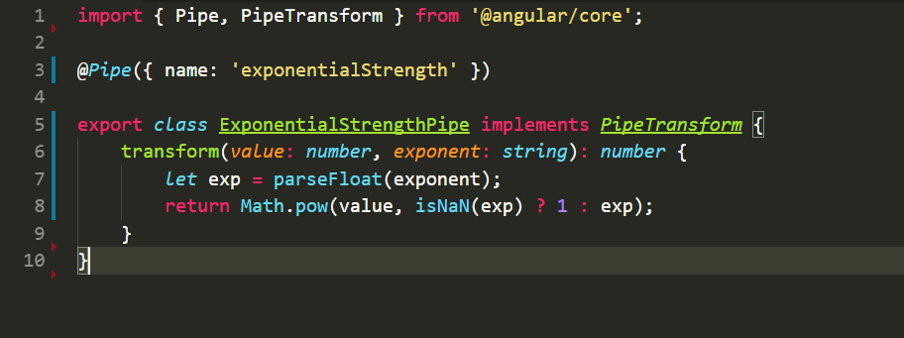

###说明

Angular4中的管道和Angular.js中的过滤器一样，都是对数据进行处理，叫法不同而已。

###常用内置管道

名称|管道
-|-
异步管道 |` AsyncPipe`
货币管道 |` CurrencyPipe`
日期管道 |`DatePipe`
十进制管道 |`DecimalPipe`
禁止货币管道 |`DeprecatedCurrencyPipe`
删除小数部分管道 |`DeprecatedDecimalPipe`
未注明日期管道 |`DeprecatedDatePipe`
不合格百分比管道 |`DeprecatedPercentPipe`
Json转换管道 |`JsonPipe`
小写转换管道 |`LowerCasePipe`
大写转换管道 |`UpperCasePipe`
截取长度管道 |`SlicePipe`

###自定义管道

