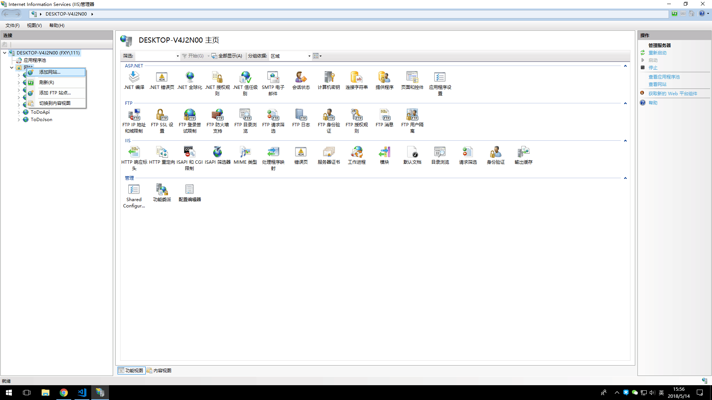
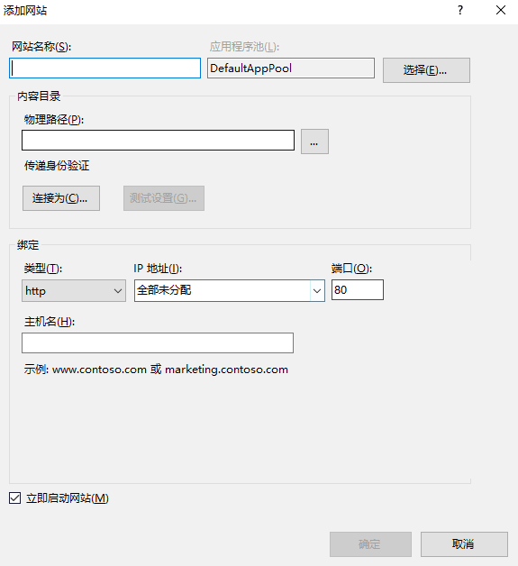

###将编译后LUNZ+框架项目文件放在本地

###启用 IIS 功能

> 启用windows IIS（Internet Information Services)功能

> 参照 [https://jingyan.baidu.com/article/219f4bf723bcb2de442d38ed.html](https://jingyan.baidu.com/article/219f4bf723bcb2de442d38ed.html)

###添加网站

> 打开控制面板，选择'管理工具' > 'Internet 信息服务(IIS)管理器' 打开IIS管理器

> 添加网站，填写配置信息 [物理路径为LUNZ+框架在本地的目录]

