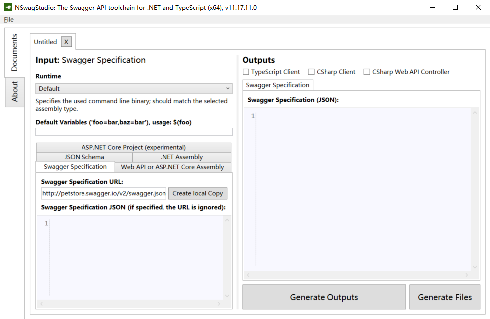
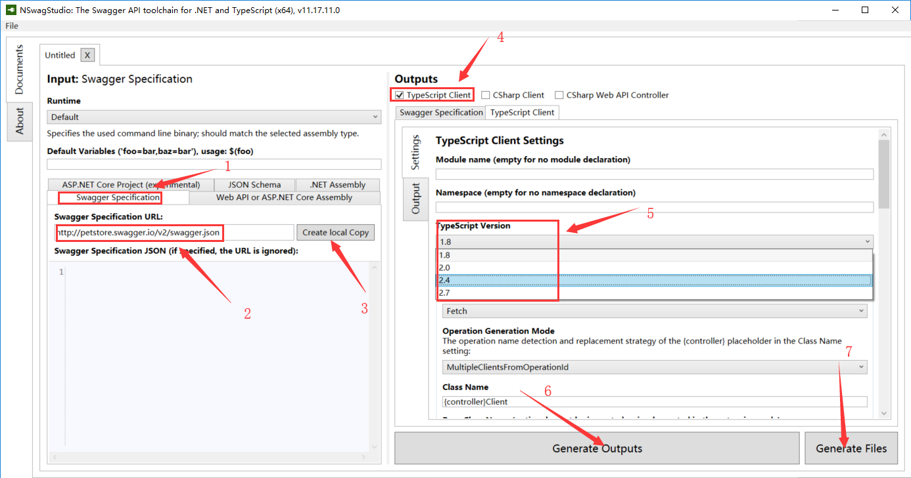
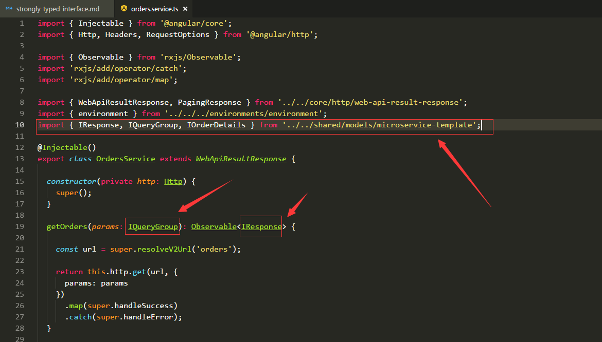

###说明
强类型化接口指的是在编写service时，定义向服务器端请求方法中，指定参数的数据类型和返回数据的数据类型。
###如何使用？
1. 工具： NSwagStudio，下载地址： [https://github.com/RSuter/NSwag/wiki/NSwagStudio](https://github.com/RSuter/NSwag/wiki/NSwagStudio)
2. 打开安装的NSwagStudio,如下：

3. 选择'Swagger Specification'，如下图 ‘1’
4. 填写请求数据url，如下图 ‘2’
5. 点击 'Create local Copy' 按钮，如下图 ‘3’，返回json数据
6. 配置输出，选择 'TypeScript Client'，如下图 ‘4’
7. 选择TypeScript版本，如下图‘5’
8. 选择文件输入路径【配置页面页脚处】
9. 其他配置依需要设置
10. 点击'Generate Outputs'按钮（如下图 ‘6’）输出数据，点击'Generate Files'按钮（如下图 ‘7’）数据以.ts文件的的形式输出到配置的路径下

11. 将文件放到项目中，在server中将文件中定义的interface（接口）引入，在定义向服务器端请求方法中使用，如下图红色框中：
